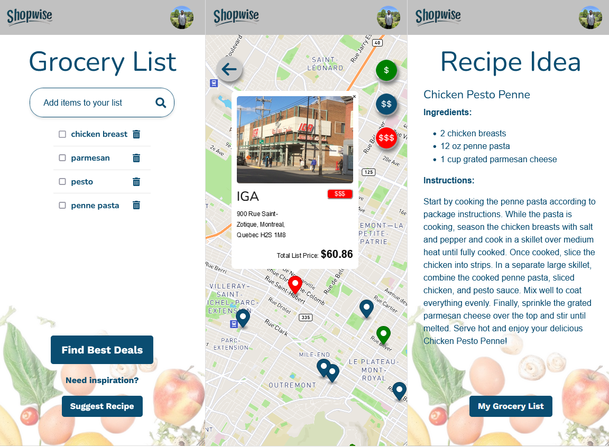

<h1 class="heading-element" dir="auto">ShopWise</h1>

  ShopWise is a mobile application that helps users find the best total price on groceries and generate recipes based on a given list of items. ShopWise will indicate the store with the lowest and highest total price, enabling comparison and choosing based on preference. It will also generate a creative recipe based on the items on your list.

You can access the App by clicking:

<h2 align="left">App Preview:</h2>

<h2 class="heading-element" dir="auto">Features:</h2>

- Creating a grocery list: By adding and/or deleting items to the user's list.
- Finding the total price for grocery store.
- 

Rails app generated with [lewagon/rails-templates](https://github.com/lewagon/rails-templates), created by the [Le Wagon coding bootcamp](https://www.lewagon.com) team.
